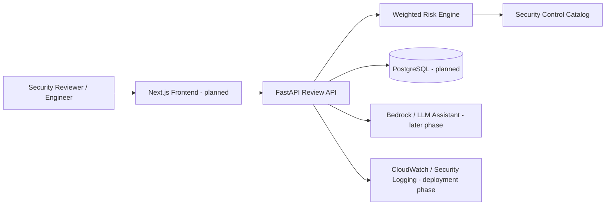

# Architecture — Cloud Security Architecture Review Platform

## MVP logical architecture

## Current implementation

The first milestone intentionally begins with the backend review engine before adding cloud infrastructure or an AI layer. This allows the security logic to remain deterministic, explainable, testable, and independent of an LLM.

### Review flow

1. An engineer submits architecture context and security-control answers.
2. FastAPI validates the request with Pydantic schemas.
3. The risk engine determines which controls are applicable.
4. Applicable controls contribute to a weighted score.
5. Failed controls generate severity-ranked findings and remediation guidance.
6. The API returns an assessment result that can later be persisted, displayed, exported, or enriched by AI.

## Scoring model

The MVP uses ten weighted controls totaling 100 possible points when all are applicable.

| Control | Domain | Weight | Failure Severity |
|---|---|---:|---|
| IAM-01 | Privileged MFA | 15 | Critical |
| IAM-02 | Least privilege | 12 | High |
| NET-01 | Restrict public access | 15 | Critical |
| NET-02 | Network segmentation | 10 | High |
| DATA-01 | Encryption at rest | 10 | High |
| DATA-02 | Encryption in transit | 10 | High |
| SEC-01 | Secrets management | 8 | High |
| LOG-01 | Centralized logging | 8 | High |
| RES-01 | Backup and recovery | 7 | Medium |
| APP-01 | WAF for public applications | 5 | Medium |

Controls that do not apply are removed from the denominator rather than counted as failures or free points. Examples:

- WAF is not scored for an application that is not internet-facing.
- Backup control is not scored for stateless workloads.
- Secrets-management control is not scored when the application does not use application secrets.

This keeps the score explainable and avoids penalizing architectures for irrelevant controls.

## Risk ratings

| Score | Rating |
|---:|---|
| 90-100 | Low |
| 75-89 | Moderate |
| 60-74 | High |
| 0-59 | Critical |

## Security design principles

- No production or employer data is required.
- Sample assessments use synthetic names and values.
- LLM output will not determine the authoritative score.
- Security findings remain traceable to explicit controls.
- Secrets will be stored outside source code when cloud integrations are added.
- Authentication, authorization, encryption, logging, and least privilege will be included in the deployment threat model.

## Planned AWS deployment

The target deployment will evolve toward:

- CloudFront / HTTPS entry point
- Hosted frontend
- API service in AWS
- PostgreSQL-compatible persistence
- Secrets Manager for application secrets
- CloudWatch logging and alarms
- IAM roles with least privilege
- KMS-backed encryption
- AWS WAF for internet-facing protection
- Terraform for infrastructure provisioning
- GitHub Actions for CI/CD

Exact service choices will be selected during the infrastructure milestone so the architecture decision itself can be documented as part of the portfolio project.
